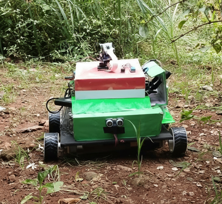
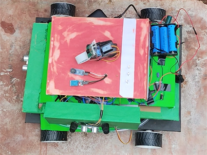

<p align="center">
  
</p>

<h1 align="center">🌱🤖 KrishiNetra</h1>
<h3 align="center">Autonomous Agro-Robot for Plant Stress Identification and Targeted Treatment</h3>

<p align="center">
  
  
  
  
</p>

---

## 🌾 Overview

**KrishiNetra** is an autonomous terrestrial agro-robot designed to democratize **precision agriculture** through  
**Site-Specific Crop Management (SSCM)**.

It integrates **Edge AI**, **multi-angle computer vision**, and **environment-aware actuation** to detect plant stress and perform **targeted treatment**, significantly reducing chemical wastage, environmental damage, and manual labor.

---

## 📸 Project Glimpses

| **System Architecture** | **Robot – Front View** | **Robot – Top View** |
|:-----------------------:|:----------------------:|:-------------------:|
|  |  |  |
| *Distributed Master–Slave Topology* | *Field-Deployable Skid-Steer Robot* | *Component & Sensor Layout (Top)* |

---

## 📑 Table of Contents
- [Problem Statement](#-problem-statement)
- [Key Features](#-key-features)
- [System Architecture](#-system-architecture)
- [Hardware Stack](#-hardware-stack)
- [Software & AI Pipeline](#-software--ai-pipeline)
- [Installation & Setup](#-installation--setup)
- [Usage](#-usage)
- [Results](#-results)
- [Future Enhancements](#-future-enhancements)

---

## ⚠️ Problem Statement

Conventional agriculture relies on **blanket spraying**, where chemicals are uniformly applied across entire fields. This leads to:

1. **30–50% chemical wastage**
2. **Soil degradation** and groundwater contamination
3. **Phytotoxicity** due to spraying during high temperatures
4. **Health risks** to farmers from direct chemical exposure

Existing automation methods such as **aerial drones** suffer from:
- Canopy occlusion (cannot see under leaves)
- Limited battery life
- High operational costs

**KrishiNetra** solves these issues using **ground-level vision**, **multi-angle scanning**, and **precision spraying**.

---

## 🚀 Key Features

### 🧠 1. Distributed Edge Intelligence
- Fully offline operation using a **Raspberry Pi (Master)** and **Arduino (Slaves)**
- No cloud or internet dependency, suitable for rural environments

---

### 👁️ 2. Multi-Angle Stop-and-Scan Vision
- Pan–Tilt camera captures images at:
  - **Top (~75°)**
  - **Middle (~90°)**
  - **Bottom (~120°)**
- Enables detection of **under-leaf pests and hidden stress**, outperforming aerial imaging

---

### 🛡️ 3. Smart Treatment Planner (Core Novelty)
- **Environmental Gating**
  - Blocks spraying when **Humidity > 85%**
  - Reduces spray volume by **25% when Temperature > 35°C**
- **Selective Actuation**
  - Activates only the required **pesticide, nutrient, or water pump**

---

### 🧭 4. GPS-Free Navigation
- **Hall-effect wheel odometry** for distance estimation
- **Ultrasonic sensors** for row alignment and obstacle avoidance
- Achieves **±5% navigation accuracy** without GPS or RTK systems

---

## ⚙️ System Architecture

KrishiNetra follows a **Master–Slave architecture** using **USB Serial (UART)** communication.

### 🧠 Master Node — Raspberry Pi 4
- YOLOv8n inference (ONNX, CPU-optimized)
- Flask-based web dashboard
- Mission logic, decision-making, and logging
- SQLite database for records

### ⚙️ Slave Node 1 — Arduino Uno
- DC motor control via L298N
- Pump and relay actuation
- Wheel odometry using hardware interrupts

### 🎯 Slave Node 2 — Arduino Nano
- Pan–Tilt servo control
- Environmental sensing (DHT11)
- Status LEDs and precision timing

---

## 🛠 Hardware Stack

| Component | Specification | Function |
|---------|---------------|----------|
| Compute | Raspberry Pi 4 Model B (4GB) | AI inference & web server |
| Controllers | Arduino Uno & Nano | Real-time control |
| Vision | Pi Camera Module v1.3 (5MP) | Image acquisition |
| AI Model | YOLOv8n (Nano) | Stress detection |
| Locomotion | 4× 12V DC Geared Motors | Skid-steer drive |
| Drivers | 2× L298N Dual H-Bridge | Motor control |
| Sensors | HC-SR04, DHT11, Hall-Effect | Navigation & safety |
| Power | 3S Li-Ion Battery (11.1V) | System power |

---

## 💻 Software & AI Pipeline

### 🧠 AI Model
- **Architecture:** YOLOv8n
- **Training Data:** 65,000+ annotated plant images
- **Classes (12):**  
  `Healthy`, `Fungal_Blight`, `Rust_Mildew`, `Bacterial_Spot`, `Nutrient_Deficiency`, etc.
- **Framework:** PyTorch → ONNX
- **Inference Speed:** ~350–450 ms on Raspberry Pi 4 (CPU)

---

### 🧩 Backend
- **Framework:** Flask
- **Communication:** REST APIs + PySerial (UART)
- **Database:** SQLite
- **Libraries:** ultralytics, onnxruntime, opencv-python, flask, pyserial

---

## 📥 Installation & Setup

### Prerequisites
- Python **3.9+**
- Arduino IDE
- Raspberry Pi OS

### 1️⃣ Clone the Repository
```bash
git clone https://github.com/yourusername/KrishiNetra.git
cd KrishiNetra
```

### 2️⃣ Setup Raspberry Pi
```bash
pip install -r requirements.txt
```

### 3️⃣ Flash Microcontrollers
- Arduino Uno:  
  `arduino_firmware/uno_motion_controller.ino`
- Arduino Nano:  
  `arduino_firmware/nano_sensor_controller.ino`

### 4️⃣ Hardware Connections
- Connect Raspberry Pi to both Arduinos via USB
- Update serial port names in `config.py` if required

---

## 🕹️ Usage

### Start the System
```bash
python main.py
```

### Access Web Dashboard
```text
http://<Raspberry_Pi_IP>:5000
```

### Operation Flow
1. Navigate crop row
2. Stop at plant
3. Multi-angle image capture
4. YOLOv8 stress detection
5. Environment-aware spray decision
6. Targeted treatment
7. Live monitoring via dashboard

---

## 📊 Results

- **AI Accuracy:** mAP@0.5 = **0.886** (Precision: **91.9%**)
- **Navigation Accuracy:** ±5% linear error
- **Safety Compliance:** 100% spray-abort success when Humidity > 85%
- **Canopy Coverage:** 94% improvement in under-leaf detection
- **Chemical Usage:** Significantly reduced via selective spraying

---

## 🔮 Future Enhancements

- NVIDIA Jetson Orin Nano for <100 ms inference
- LiDAR + RTK-GPS for SLAM-based navigation
- Industrial-grade aluminum chassis
- LoRaWAN for >5 km telemetry
- Multi-robot fleet coordination


---

### 🌾 *KrishiNetra — Intelligence at the Root Level of Agriculture*
